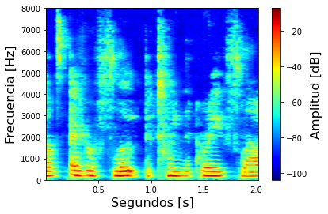

# Deep learning based speech dereverberation 

### Final project to achieve the Sound Engineer degree from UNTREF (Universidad Nacional de Tres de Febrero).

In this work deep learning based speech dereverberation is studied. A type of convolutional neural network called autoencoder with jump connections is implemented, combining techniques of the current state of the art. 

This autoencoder is trained to receive a magnitude spectrogram of an reverberated audio signal, and generate an amplitude mask which when is applyed over the initial spectrogram, produces the magnitude spectrogram of the dereverberated audio signal. 

| Input Spectrogram | Estimated Mask | Dereverberated Spectrogram | Target Spectrogram |
:---------:|:---------:|:---------:|:---------:
 | | | 

